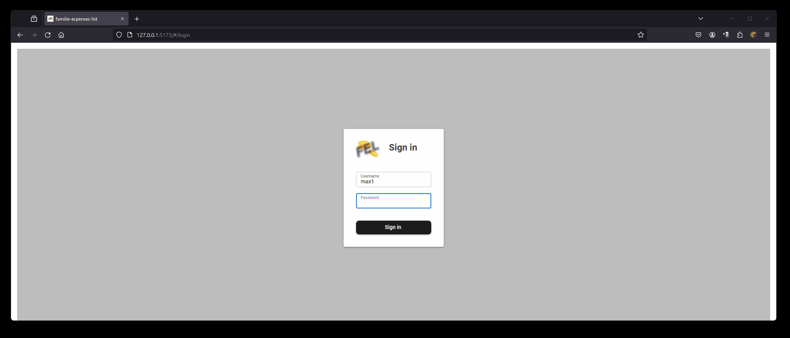

# family-expenses-list-frontend

### My intention for creating this project: 
All members of family can store their expenses at one place.

They also can filter and show the whole expenses at any time. 





#
link to the associated backend project [click here](https://github.com/Oigty81/family-expenses-list-backend)

#
### todo

- [ ] add category filter option for show expenses
- [ ] add a PDF-Export feature
- [ ] add language support

# 
## Project setup

### Prerequisite

- [Node.JS v16](https://nodejs.org/download/release/v16.9.1/)

### Install the repository
```
git clone https://github.com/Oigty81/family-expenses-list-frontend.git
cd family-expenses-list-frontend
npm install
```

### Compiles and hot-reloads for development
```
npm run dev
```

### Compiles and minifies for production
```
npm run build
```

### Run your unit tests
```
npm run test
```

# 