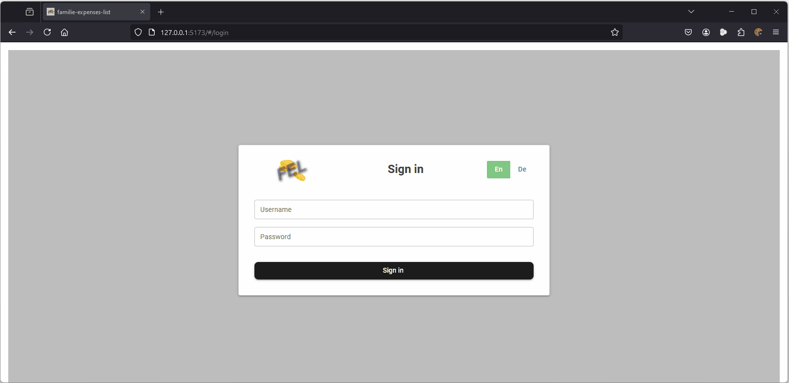

# family-expenses-list-frontend

### My intention for creating this project: 
All members of family can store their expenses at one place.

Everyone can show the whole expenses at any time.

Filters can be set by categories, time periods and metatext.





#
link to the associated backend project [click here](https://github.com/Oigty81/family-expenses-list-backend)

#
### todo

- [x] add category and metatext filter option for show expenses
- [x] add multi language support (en/ge)
- [ ] add a PDF-Export feature
- [ ] add unit tests for all components
- [ ] add list-view for category and category composition
- [ ] add an update/delete feature for categories and category composition that are not yet in use

# 
## Project setup

### Prerequisite

- [Node.JS v16](https://nodejs.org/download/release/v16.9.1/)

### Install the repository
```
git clone https://github.com/Oigty81/family-expenses-list-frontend.git
cd family-expenses-list-frontend
npm install
```

### Compiles and hot-reloads for development
```
npm run dev
```

### Compiles and minifies for production
```
npm run build
```

### Run your unit tests
```
npm run test
```

# 